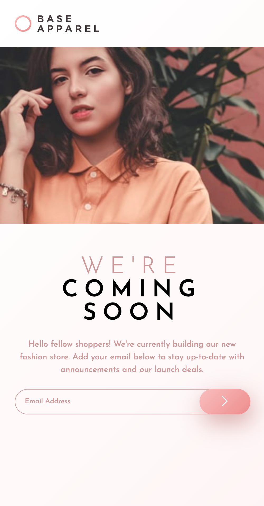
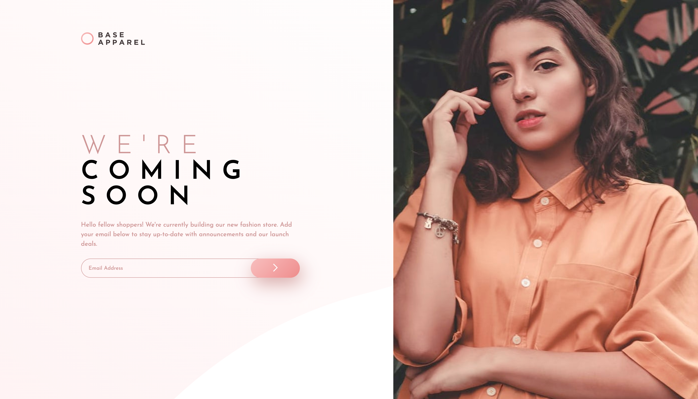
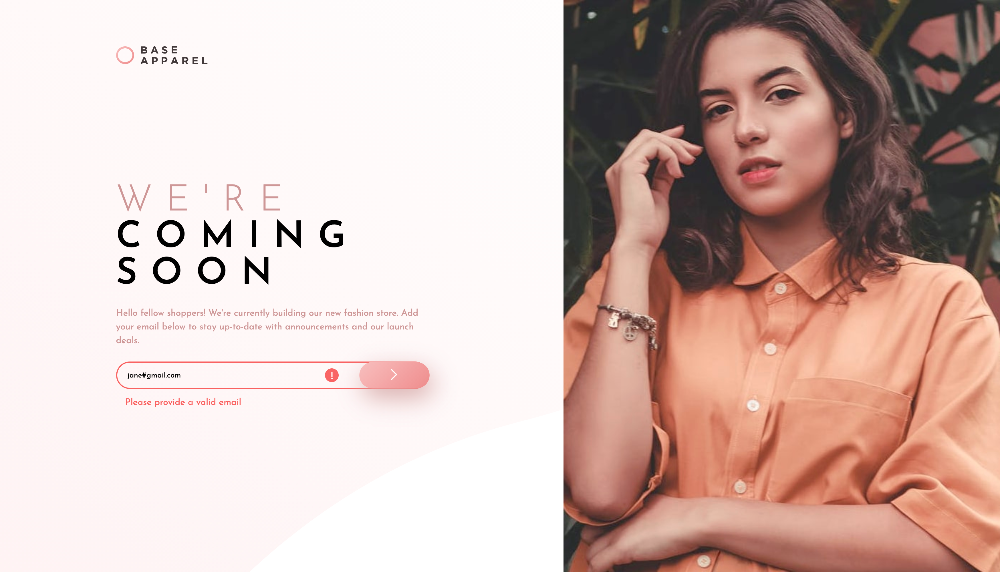

# Frontend Mentor - Base Apparel coming soon page solution

This is a solution to the [Base Apparel coming soon page challenge on Frontend Mentor](https://www.frontendmentor.io/challenges/base-apparel-coming-soon-page-5d46b47f8db8a7063f9331a0). Frontend Mentor challenges help you improve your coding skills by building realistic projects. 

## Table of contents

- [Overview](#overview)
  - [The challenge](#the-challenge)
  - [Screenshot](#screenshot)
  - [Links](#links)
- [My process](#my-process)
  - [Built with](#built-with)
  - [What I learned](#what-i-learned)
  - [Continued development](#continued-development)
  - [Useful resources](#useful-resources)

## Overview

### The challenge

Users should be able to:

- View the optimal layout for the site depending on their device's screen size
- See hover states for all interactive elements on the page
- Receive an error message when the `form` is submitted if:
  - The `input` field is empty
  - The email address is not formatted correctly

### Screenshot

### Links

- Solution URL: [https://github.com/emilyw12/base-apparel-coming-soon](https://github.com/emilyw12/base-apparel-coming-soon)
- Live Site URL: [https://emilyw12.github.io/base-apparel-coming-soon/](https://emilyw12.github.io/base-apparel-coming-soon/)

## My process

### Built with

- Semantic HTML5 markup
- Flexbox
- Mobile-first workflow

### What I learned

This was the first time I tried form validation with JavaScript, so I was learning how to utilize the Constraint Validation API to customize my own styled error messages. I was able to manipulate the display of the error message and style of the form border depending on whether the email provided was in a valid format. I also had some trouble with responsiveness of the hero image, so I needed to look up some methods for how to solve the issue. I opted to use the method of using the `<picture>` element along with the `srcset` attribute to switch images for mobile and desktop layouts, and used `min-height: 100vh` with `object-fit: cover` for the desktop version to ensure that the image took up the full height of the browser, but didn't distort the proportions when resized. 

### Continued development

I'm only just getting started with creating projects with JavaScript, so I'll continue to practice with beginning JavaScript concepts on other Frontend Mentor challenges.

### Useful resources

- [freeCodeCamp: CSS Responsive Image Tutorial](https://www.freecodecamp.org/news/css-responsive-image-tutorial/) - This helped me with styling the hero image for desktop such that the image didn't distort when resized.
- [MDN: Client-side form validation](https://developer.mozilla.org/en-US/docs/Learn/Forms/Form_validation) - This helped me understand how to implement form validation and how to use the Constraint Validation API.
